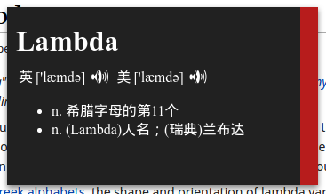

# youdao-electron



Shortcut: <kbd>Shift</kbd> + <kbd>Control</kbd> + <kbd>X</kbd>

*mouse over the red bar to hide window*

## Build

To build this repo, you need install [Boot](https://github.com/boot-clj/boot) first.

Then:

```
boot build
```

## Run

You can start the electron process using
[electron-prebuilt](https://github.com/mafintosh/electron-prebuilt) or
using a downloaded `Electron.app` package:

```
electron target/
```

## Package

The easiest way to package an electron app is by using
[`electron-packager`](https://github.com/maxogden/electron-packager):

```
electron-packager target/ youdao-electron --platform=linux --arch=ia32 --version=1.3.4
```
